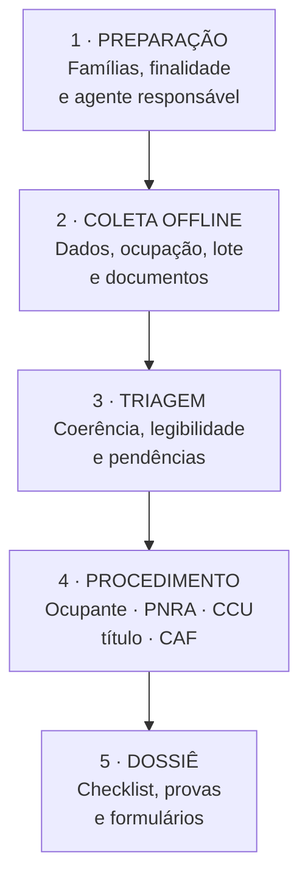
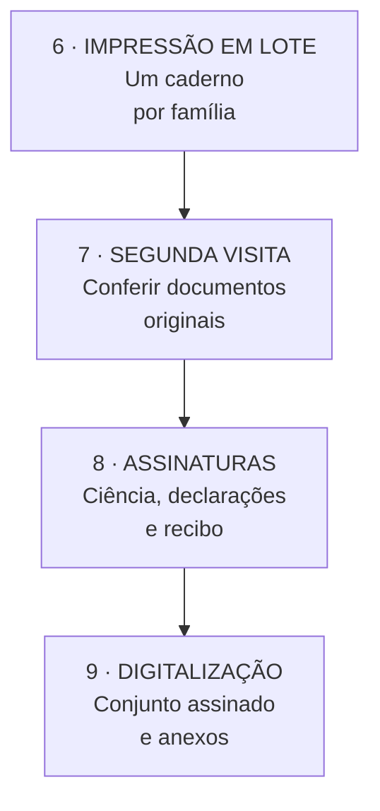
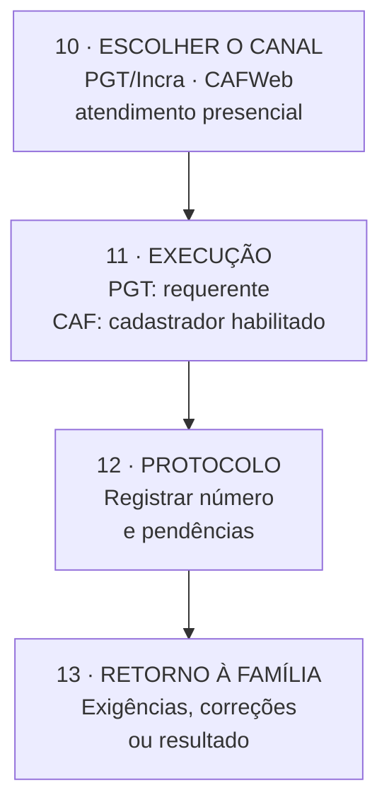

# Aplicativo de triagem documental para regularização

## Finalidade

O aplicativo deverá apoiar a coleta comunitária, organizar evidências, identificar
pendências e preparar documentos para conferência e assinatura. Ele **não regulariza a
parcela**, não substitui vistoria, análise do Incra, cadastrador autorizado ou acesso
individual à conta gov.br.

O produto de cada atendimento será um dossiê de pré-cadastro, com identificação única,
checklist, documentos digitalizados e formulários aplicáveis. Depois da revisão, o sistema
poderá gerar em lote os cadernos de cada família para conferência e assinatura em uma nova
visita.

## Fluxo de coleta, assinatura e encaminhamento

### 1. Agente e aplicativo

### 2. Documento físico

### 3. Canal público

**Agente comunitário:** coleta, confere, organiza, digitaliza, imprime e orienta.

**Documento físico:** originais, declarações aplicáveis, autorização de encaminhamento,
assinaturas e recibo.

**Canal público virtual:** o protocolo pessoal na PGT utiliza a conta gov.br do requerente.
No CAFWeb, o encaminhamento pode ser realizado por cadastrador formalmente habilitado.

!!! warning "Credenciais"
    O agente não deve guardar senha ou código de autenticação, nem utilizar a conta gov.br
    como se fosse o requerente. A execução direta exige credencial institucional aceita pelo
    órgão.

## Primeiro passo: identificar o procedimento

| Situação encontrada | Encaminhamento oficial | O que o aplicativo pode preparar |
|---|---|---|
| Família ocupa lote sem autorização do Incra | Solicitação de regularização de ocupante na PGT | dados, cronologia da ocupação, inventário e cópias das provas |
| Família já consta como beneficiária do PNRA | consulta e atualização cadastral no Incra | conferência de nomes, composição familiar, documentos e pendências |
| Beneficiário sem CCU | solicitação do CCU na PGT | orientação, conta gov.br e checklist prévio |
| Beneficiário pretende título definitivo | solicitação de TD ou CDRU na PGT | triagem dos requisitos pessoais e registro das pendências do assentamento |
| Família precisa de CAF | consulta do CAF decorrente do PNRA ou atendimento por entidade autorizada | ficha econômica e familiar, modelos oficiais aplicáveis e documentos |
| Limites da parcela não estão definidos | demanda coletiva ao Incra, com apoio técnico quando cabível | mapa de conflitos e referências locais, sem declarar limite oficial |

A titulação definitiva depende também de condições que não pertencem à família isolada:
registro da área em nome do Incra ou da União, medição e demarcação dos lotes,
georreferenciamento e certificação do perímetro e CAR do assentamento. O aplicativo deverá
mostrar essas pendências como **institucionais**, sem induzir a família a produzir uma
declaração para substituí-las.

## Formulário de campo

### 1. Controle do atendimento

- identificador comunitário, sem CPF no código;
- data, local e modalidade da entrevista;
- entrevistador e organização responsável;
- versão do questionário e dos modelos oficiais;
- finalidade selecionada;
- situação: rascunho, incompleto, em revisão, pronto para imprimir, assinado, protocolado,
  devolvido ou concluído;
- número do protocolo oficial, quando existir.

### 2. Ciência e autorização

Antes da coleta, a tela deverá informar:

- quem controla os dados e como contatar o responsável;
- finalidade específica da coleta;
- quais órgãos ou entidades poderão receber os documentos;
- que a participação não garante deferimento nem benefício;
- prazo de guarda e forma de solicitar correção ou eliminação;
- autorização separada para fotografar documentos, registrar coordenadas e compartilhar o
  dossiê com uma entidade identificada.

A autorização para organizar o dossiê não equivale a procuração e não permite acessar a
conta gov.br de outra pessoa. Quando for necessária representação, deverá ser utilizado o
instrumento admitido pelo procedimento oficial, com poderes específicos.

### 3. Pessoa requerente e vínculo familiar

- nome civil e nome social;
- CPF, data de nascimento, documento de identificação e filiação;
- nacionalidade, estado civil e documento comprobatório;
- endereço, telefone e meio seguro de retorno;
- nome e CPF do cônjuge ou companheiro;
- composição da unidade familiar: nome, parentesco, nascimento, CPF dos maiores de 16 anos,
  residência, ocupação e fonte de renda;
- filhos e respectivas certidões de nascimento;
- existência de conta gov.br própria e possibilidade de recuperação do acesso;
- necessidade de acessibilidade, alfabetização assistida ou intérprete.

Dados sobre saúde, deficiência, origem étnica ou outros dados sensíveis só devem ser
coletados quando indispensáveis ao atendimento escolhido, com acesso restrito.

### 4. Assentamento, lote e ocupação

- nome do assentamento, município, estado e código oficial, se conhecido;
- referência local do lote e nome pelo qual é conhecido;
- titular anterior ou forma pela qual a família chegou à área;
- data de início da ocupação e da exploração;
- períodos de ausência e justificativa;
- moradia e exploração atuais pela unidade familiar;
- atividade produtiva, benfeitorias, acesso à água, energia e estradas;
- área aproximada informada pela família, sem converter essa informação em medição oficial;
- confrontantes conhecidos e divergências de limite;
- disputa, ameaça, cessão, arrendamento ou outra controvérsia relatada;
- existência de CCU, CDRU, título, certidão de assentado, Relação de Beneficiários ou
  protocolo anterior;
- existência de outro imóvel rural ou benefício anterior do PNRA;
- vínculo com cargo público, CNPJ, emprego ou benefício previdenciário do requerente e do
  cônjuge.

O sistema deverá distinguir “declarado pela família”, “comprovado por documento” e
“confirmado em base oficial”.

### 5. Provas da ocupação e exploração

Para pedido de regularização de ocupante, o Incra indica documentos que demonstrem tanto a
data de ocupação quanto a exploração atual. O inventário deverá admitir:

- contas de energia;
- notas fiscais de compra ou venda de produtos, insumos ou serviços;
- comprovantes de vacinação de animais;
- declarações de escola, unidade básica de saúde, sindicato rural ou colônia de pescadores
  que indiquem a exploração no lote;
- declarações de entidade governamental de assistência técnica ou secretaria municipal de
  agricultura;
- declaração de conselho estadual ou municipal de desenvolvimento rural sustentável;
- atas registradas de reuniões do assentamento;
- certificados de cursos realizados no projeto de assentamento;
- outros registros relacionados à ocupação.

Também deverão ser conferidos, conforme o caso:

- prova de emancipação do requerente ou cônjuge entre 16 e 18 anos;
- documento que demonstre compatibilidade de cargo público com serviço de interesse
  comunitário rural;
- extrato da Receita Federal sobre CPF vinculado a CNPJ;
- extrato CNIS detalhado do requerente e do cônjuge;
- prova do estado civil;
- certidões de nascimento dos filhos.

Cada arquivo deverá registrar tipo, emissor, data, período que ajuda a comprovar,
legibilidade, número de páginas e eventual necessidade de atualização. Fotografias do lote
servem como evidência complementar, não como prova isolada ou medição.

### 6. Módulo econômico para o CAF

Esse módulo somente será aberto quando houver encaminhamento para o CAF:

- condição de posse e documento correspondente;
- área total e forma de exploração;
- gestão e mão de obra predominantemente familiares;
- produção vegetal, animal, extrativista, artesanal e outras atividades;
- receitas brutas da unidade familiar por fonte e período;
- rendas externas, benefícios e outras receitas;
- documentos de renda disponíveis;
- número ou situação do CAF já existente.

Antes de refazer o cadastro, deverá ser consultada a possível inclusão automática dos
beneficiários reconhecidos do PNRA no CAF. A emissão ou atualização definitiva cabe à Rede
CAF autorizada ou ao fluxo oficial de interoperabilidade.

## Formulário oficial ou declaração pessoal?

Não há um único formulário impresso capaz de produzir a regularização. A solução correta
depende do procedimento:

| Documento | Uso correto |
|---|---|
| Ficha comunitária do aplicativo | instrumento interno de triagem; não substitui requerimento oficial |
| Formulário eletrônico da PGT | requerimento oficial de regularização, CCU ou título, acessado pela conta gov.br do interessado |
| Autodeclaração comum criada pelo projeto | evidência complementar, quando pertinente; não cria direito nem substitui documento exigido |
| Autodeclaração de ocupação de terra — Anexo IV da Portaria MDA nº 20 | modelo oficial para hipótese específica de inscrição no CAF |
| Declaração de consentimento à ocupação — Anexo V | modelo oficial do CAF para a situação prevista na norma |
| Autodeclaração de renda — Anexo I | modelo oficial do CAF, quando aplicável |
| Declaração de Veracidade do CAFWeb | gerada pelo sistema ao final do cadastro, assinada e anexada conforme o procedimento |
| CCU, CDRU, TD ou certidão de beneficiário do PNRA | documento oficial; declaração particular não o substitui |

Portanto, o aplicativo poderá preencher versões de trabalho dos modelos oficiais, mas deverá
manter uma biblioteca de modelos com fonte, data e versão. Antes da impressão, um responsável
deverá confirmar que o formulário permanece vigente. Campos, advertências e texto legal dos
anexos oficiais não devem ser resumidos ou reescritos.

## Fluxo operacional

### Visita 1 — coleta

1. explicar finalidade, limites e proteção de dados;
2. selecionar o procedimento provável;
3. obter autorização de coleta;
4. preencher o questionário offline;
5. fotografar apenas os documentos autorizados;
6. registrar lacunas e entregar um comprovante simples do atendimento.

### Revisão remota

1. validar CPF, datas e coerência familiar;
2. remover duplicidades;
3. classificar as provas por requisito;
4. verificar se a pessoa já consta no PNRA ou no CAF pelos canais admitidos;
5. escolher somente os modelos oficiais pertinentes;
6. devolver pendências ao responsável territorial.

### Impressão em lote

Quando o cadastro estiver “pronto para imprimir”, o sistema deverá gerar um caderno por
família:

1. folha de rosto com código, procedimento e pendências;
2. ficha de conferência dos dados;
3. formulário oficial aplicável, sem alterar seu conteúdo;
4. relação numerada dos anexos;
5. aviso de privacidade e autorização de encaminhamento;
6. páginas de assinatura e recibo da família.

Os cadernos poderão ser unidos em um PDF de lote, separados por folha com código de barras
ou QR code contendo apenas o identificador interno. Nome, CPF e documentos não devem estar
codificados no QR. Cada página deverá trazer o código da família, numeração
“página X de Y” e versão do formulário.

Cadastros incompletos não devem gerar declarações para assinatura. Eles podem gerar apenas
uma lista de pendências.

### Visita 2 — conferência e assinatura

1. conferir identidade e documentos originais;
2. ler o conteúdo para quem solicitar apoio;
3. corrigir divergências antes da assinatura;
4. colher assinatura, data e identificação do apoio à leitura, quando houver;
5. digitalizar o conjunto assinado;
6. entregar recibo e explicar o próximo passo.

### Protocolo e acompanhamento

O interessado deverá usar sua própria conta gov.br na PGT. Entidade ou profissional
autorizado encaminhará o CAF. O aplicativo guardará apenas situação, data, órgão, protocolo,
pendências e retorno, evitando replicar indefinidamente todo o dossiê.

## Requisitos de implantação

### Produto mínimo

- aplicativo web instalável, com funcionamento sem conexão;
- banco local criptografado e bloqueio por senha;
- perfis de coletor, revisor e administrador;
- questionário condicional por procedimento;
- captura de documentos com avaliação de legibilidade;
- fila de sincronização quando houver conexão;
- painel de pendências e duplicidades;
- geração individual e em lote de PDFs;
- registro de versão dos formulários;
- trilha de auditoria de alterações, impressão e compartilhamento;
- exportação de dossiê e eliminação controlada.

### Salvaguardas

- definir formalmente controlador, operadores e responsável pelo atendimento aos titulares;
- coletar somente dados necessários à finalidade selecionada;
- criptografar aparelho, transmissão e servidor;
- não usar WhatsApp pessoal como arquivo de documentos;
- impedir exportação geral por coletores;
- limitar coordenadas, fotos e dados sensíveis;
- manter cópia de segurança criptografada;
- definir prazos de retenção por fase;
- registrar incidentes e possuir procedimento de resposta;
- testar inicialmente com dados fictícios e, depois, com grupo pequeno e autorizado.

## Implantação sugerida

1. validar esta matriz com a Superintendência Regional do Incra e uma entidade da Rede CAF;
2. mapear os casos reais sem coletar documentos;
3. fechar o aviso de privacidade e as responsabilidades institucionais;
4. obter os modelos oficiais vigentes;
5. construir protótipo somente de triagem e impressão;
6. testar com dados fictícios;
7. realizar piloto pequeno, medir tempo, erros e retrabalho;
8. ampliar apenas após validação do fluxo oficial.

## Fontes oficiais consultadas

- [Serviço de regularização de ocupante em assentamento](https://www.gov.br/pt-br/servicos/solicitar-regularizacao-de-ocupante-em-assentamento)
- [Documentos comprobatórios indicados pelo Incra](https://www.gov.br/incra/pt-br/assuntos/reforma-agraria/incra-documentos-regularizacao-ocupante.pdf/@@display-file/file)
- [Titulação de assentamentos](https://www.gov.br/incra/pt-br/assuntos/reforma-agraria/titulacao)
- [Solicitação de título de assentamento](https://www.gov.br/pt-br/servicos/solicitar-titulo-de-assentamento)
- [PNRA e inclusão no CAF](https://www.gov.br/mda/pt-br/acesso-a-informacao/acoes-e-programas/programas-projetos-acoes-obras-e-atividades/cadastro-nacional-da-agricultura-familiar/pnra)
- [Portaria MDA nº 20 e anexos do CAF](https://www.gov.br/mda/pt-br/acesso-a-informacao/acoes-e-programas/programas-projetos-acoes-obras-e-atividades/cadastro-nacional-da-agricultura-familiar/PortariaMDAn202023ealteraesv.2.pdf)
- [Guia de segurança para agentes de tratamento de pequeno porte — ANPD](https://www.gov.br/anpd/pt-br/centrais-de-conteudo/materiais-educativos-e-publicacoes/guia-vf.pdf)

!!! warning "Validação necessária"
    Este documento organiza uma solução técnica com base nas fontes oficiais consultadas em
    julho de 2026. Antes do piloto, o fluxo e os modelos deverão ser confirmados com o Incra,
    a Rede CAF e assessoria jurídica ou de proteção de dados. Regras e formulários podem ser
    alterados.
