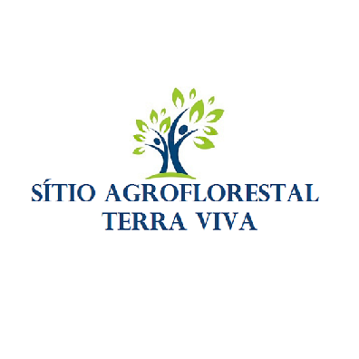
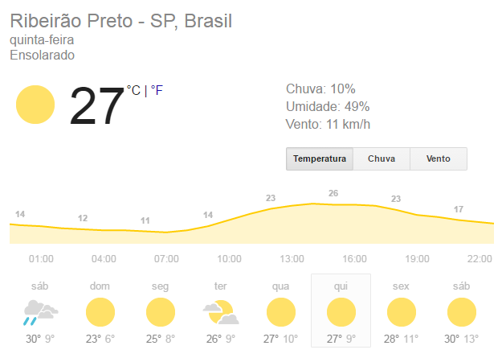
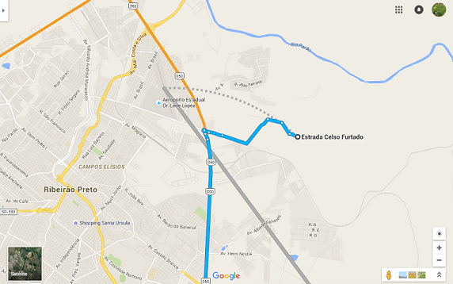

**CARTA DE BOAS VINDAS**{width="1.8177088801399826in" height="1.8177088801399826in"}

É com grande satisfação que o Sítio Agroflorestal dá as boas vindas aos participantes da Vivência Agroflorestal Terra Viva: Ecologia, Política, Economia, Emancipação e Comida de Verdade. Nesse documento constam algumas informações importantes, leiam atentamente!

**[CAMPING]{.smallcaps}**

Os participantes do curso ficarão alojados no Sítio Agroflorestal com área coberta e descoberta para acampar, banheiro seco e chuveiro quente!

**ALIMENTAÇÃO**

Toda a alimentação do curso será preparada no próprio Sítio Agroflorestal com um cardápio diversificado para vegetarianos, veganos e cuidado com intolerantes a glúten e lactose.

**O QUE TRAZER**

**Camping:**

- Barraca

- Colchão/Colchonete/Saco de dormir

- Lençol

- Cobertor

- Travesseiro

- Toalha de banho

- Utensílios de higiene pessoal

**Campo:**

- Bota ou sapato fechado

- Calça comprida

- Camisas de manga comprida

- Chapéu

- Capa de chuva

- Protetor solar

- Repelente

- Caderno e caneta para anotações

- Facão

- Tesoura de poda

- Serra de Poda

- Lima

**PROGRAMAÇÃO**

+------------------------------------------------------------------------------------------------------------------------------------+
| **Quarta (20/07)**                                                                                                                 |
+--------------------------------------+--------------------------------------+------------------------------------------------------+
| **Local**                            | **Horário**                          | **Atividades**                                       |
+--------------------------------------+--------------------------------------+------------------------------------------------------+
| **Sítio Agroflorestal**              | **19:00**                            | **Recepção e Jantar**                                |
+--------------------------------------+--------------------------------------+------------------------------------------------------+
| **Quinta (21/07)**                                                                                                                 |
+--------------------------------------+--------------------------------------+------------------------------------------------------+
| **Local**                            | **Horário**                          | **Atividades**                                       |
+--------------------------------------+--------------------------------------+------------------------------------------------------+
| **Sítio Agroflorestal**              | **7:00**                             | **Recepção e Café da manhã**                         |
|                                      +--------------------------------------+------------------------------------------------------+
|                                      | **8:00**                             | **Boas vindas/Abertura**                             |
|                                      +--------------------------------------+------------------------------------------------------+
|                                      | **8:30**                             | **Dinâmica de apresentação**                         |
|                                      +--------------------------------------+------------------------------------------------------+
|                                      | **9:30**                             | **Café Mundial**                                     |
|                                      +--------------------------------------+------------------------------------------------------+
|                                      | **11:00**                            | **Conhecendo o Sítio**                               |
|                                      +--------------------------------------+------------------------------------------------------+
|                                      | **12:00**                            | **Almoço**                                           |
|                                      +--------------------------------------+------------------------------------------------------+
|                                      | **13:30**                            | **Práticas de campo**                                |
|                                      +--------------------------------------+------------------------------------------------------+
|                                      | **17:00**                            | **Sistematização das práticas**                      |
|                                      +--------------------------------------+------------------------------------------------------+
|                                      | **18:00**                            | **Horário Livre**                                    |
|                                      +--------------------------------------+------------------------------------------------------+
|                                      | **19:30**                            | **Jantar**                                           |
|                                      +--------------------------------------+------------------------------------------------------+
|                                      | **20:30**                            | **Fundamentos da agrofloresta**                      |
+--------------------------------------+--------------------------------------+------------------------------------------------------+
| **Sexta (22/07)**                                                                                                                  |
+--------------------------------------+--------------------------------------+------------------------------------------------------+
| **Local**                            | **Horário**                          | **Atividades**                                       |
+--------------------------------------+--------------------------------------+------------------------------------------------------+
| **Sítio Agroflorestal**              | **7:00**                             | **Café da manhã**                                    |
|                                      +--------------------------------------+------------------------------------------------------+
|                                      | **8:00**                             | **Práticas de campo**                                |
|                                      +--------------------------------------+------------------------------------------------------+
|                                      | **12:00**                            | **Almoço**                                           |
|                                      +--------------------------------------+------------------------------------------------------+
|                                      | **13:30**                            | **Práticas de campo**                                |
|                                      +--------------------------------------+------------------------------------------------------+
|                                      | **17:00**                            | **Sistematização das práticas**                      |
|                                      +--------------------------------------+------------------------------------------------------+
|                                      | **18:00**                            | **Horário Livre**                                    |
|                                      +--------------------------------------+------------------------------------------------------+
|                                      | **19:30**                            | **Jantar**                                           |
|                                      +--------------------------------------+------------------------------------------------------+
|                                      | **20:30**                            | **A importância da agrofloresta na reforma agraria** |
+--------------------------------------+--------------------------------------+------------------------------------------------------+
| **Sábado (23/07)**                                                                                                                 |
+--------------------------------------+--------------------------------------+------------------------------------------------------+
| **Local**                            | **Horário**                          | **Atividades**                                       |
+--------------------------------------+--------------------------------------+------------------------------------------------------+
| **Sítio Agroflorestal**              | **7:00**                             | **Café da manhã**                                    |
|                                      +--------------------------------------+------------------------------------------------------+
|                                      | **8:00**                             | **Práticas de campo**                                |
|                                      +--------------------------------------+------------------------------------------------------+
|                                      | **12:00**                            | **Almoço**                                           |
|                                      +--------------------------------------+------------------------------------------------------+
|                                      |                                      | **Comercialização**                                  |
|                                      |                                      +------------------------------------------------------+
|                                      |                                      | **Dinâmica de encerramento**                         |
|                                      +--------------------------------------+------------------------------------------------------+
|                                      | **17:00**                            | **Lanche e Encerramento**                            |
+--------------------------------------+--------------------------------------+------------------------------------------------------+
| ***Os horários são passíveis de alteração, de acordo com a dinâmica do grupo e das condições climáticas***                         |
+======================================+======================================+======================================================+

**CLIMA, TEMPO**

{width="4.045483377077865in" height="2.8802088801399823in"}

**COMO CHEGAR**

{width="5.958333333333333in" height="3.7291666666666665in"}**\
[[Referência, como chegar: São Paulo - SP \-\-\-\-\-\--\> Acampamento Mario Lago, Sítio Terra Viva]{.underline}](https://www.google.com.br/maps/dir/Estrada+Celso+Furtado,+Ribeir%C3%A3o+Preto+-+SP/S%C3%A3o+Paulo+-+SP/@-21.1539885,-47.7502315,13z/data=!4m13!4m12!1m5!1m1!1s0x94b9c102f40c9d27:0x9349bc1ca065e773!2m2!1d-47.7227942!2d-21.1516272!1m5!1m1!1s0x94ce448183a461d1:0x9ba94b08ff335bae!2m2!1d-46.6333094!2d-23.5505199?hl=pt-BR)**

**DESLOCAMENTO**

**Ônibus:**

Chegando na rodoviária de Ribeirão Preto, para chegar ao Assentamento você deverá pegar o seguinte ônibus:

- Ribeirão Verde I ou Ribeirão Verde II (R\$ 3,80)

Ambos passam no terminal ao lado do CPC (Centro Popular de Compras) que fica em frente da rodoviária.

Peça ao motorista para deixa-lo no mercado Mialich. Quando chegar no mercado ligue para o pessoal da organização do curso que iremos buscar você.

- Se já souber o horário de chegada, ligue para que possamos nos organizar com antecedência!

Na rodoviária também tem táxis e moto-táxis que podem traze-lo até aqui!!

**ASSISTA AOS VÍDEOS A SEGUIR PARA FICAR POR DENTRO DO PROJETO DE AGROFLORESTA DO ASSENTAMENTO MARIO LAGO: [[https://www.youtube.com/watch?v=bL9RylrIwxg]{.underline}](https://www.youtube.com/watch?v=bL9RylrIwxg)**

[**[https://www.youtube.com/watch?v=IK0lKUJZWmY]{.underline}**](https://www.youtube.com/watch?v=IK0lKUJZWmY)

**Para qualquer dúvida estamos à disposição nos contatos abaixo:**

Email: sitioagroflorestal@gmail.com

Telefones:

Olívia: (16) 991614103

Murillo: (16) 992473065

Zaqueu: (16) 991817111

Abraços e até breve!!

Equipe Sítio Agroflorestal Terra Viva
