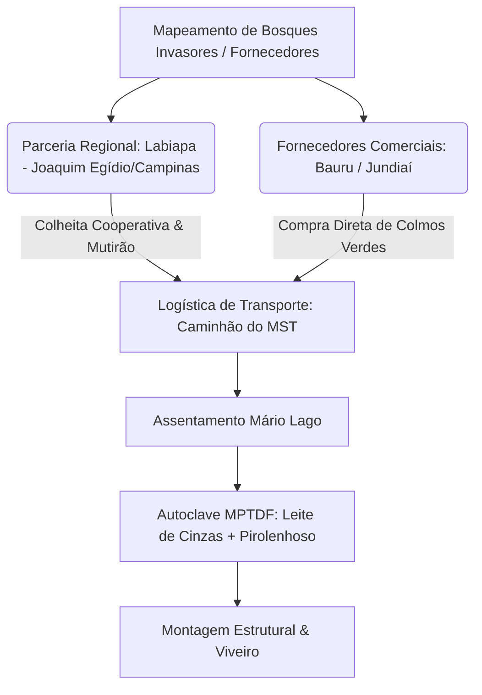

# 🗺️ Plano de Implantação: Logística de Abastecimento, Silvicultura e Soberania do Bambu
**Assentamento Mário Lago, Ribeirão Preto/SP (APA do Aquífero Guarani)**

Este plano de implantação foi estruturado para resolver a lacuna crônica de recursos construtivos no território do Mário Lago através de um fluxo logístico de curto prazo (abastecimento regional) e uma estratégia de soberania material de médio/longo prazo (silvicultura e manejo).

---

## 1. Diagnóstico do Desafio de Suprimento
* **Situação Atual**: Inexistência de bosques consolidados de espécies estruturais de bambu (*Guadua angustifolia*, *Dendrocalamus asper* ou *Bambusa tuldoides*) aptos para corte imediato no assentamento Mário Lago.
* **Fatores Limitantes**: Alta sensibilidade ambiental da zona de recarga do Aquífero Guarani (APA), proibição do uso de preservantes químicos sintéticos lixiviáveis (CCA/CCB), e alto custo de frete interestadual.
* **Oportunidade**: Abundância de bambuzais invasores sem manejo nas sub-bacias vizinhas e oferta comercial de polos consolidados no estado de São Paulo.

---

## 2. Fase 1: Cadeia de Abastecimento e Logística Regional (Curto Prazo - 0 a 6 meses)

Para atender à construção imediata do **Viveiro-Educador Terra Viva** (4m x 8m) e da **Unidade de Tratamento a Vapor MPTDF**, estabeleceu-se a seguinte logística:



### 2.1. Fontes de Aquisição Mapeadas
1. **Bosques de Co-manejo (Labiapa - Joaquim Egídio/Campinas)**: Parceria agroecológica coordenada pelo bio-arquiteto André Blanco para colheita em mutirão de colmos de *Phyllostachys aurea* (varas finas para arcos e fechamento) e *Bambusa tuldoides* (estrutural leve).
2. **Polos Comerciais de Bambu**: Compra de colmos verdes estruturais de grande diâmetro (*Dendrocalamus asper*) em plantios consolidados nas regiões de Bauru e Jundiaí/SP, garantindo a integridade mecânica das colunas principais.

### 2.2. Logística de Transporte e Custos
* **Operação**: Utilização de caminhão carroceria da cooperativa de assentados (COMUNA/MST) para minimizar custos de frete comercial.
* **Volume Inicial**: 300 metros lineares de colmos de diâmetros variados (7 a 12 cm) e 150 varas flexíveis de *Phyllostachys aurea*.
* **Tratamento Imediato no Destino**: Descarga direta na Unidade Autônoma de Autoclave e Tratamento MPTDF construída no Mário Lago, utilizando vapor saturado gerado pelo Rocket Stove e calda protetora de leite de cinzas + pirolenhoso concentrado.

---

## 3. Fase 2: Silvicultura Camponesa e Soberania de Recursos (Médio e Longo Prazo - 1 a 5 anos)

Para eliminar a dependência externa de frete e bambu de outras regiões, o assentamento implantará bosques camponeses de silvicultura agroecológica.

### 3.1. Seleção de Espécies e Zonas de Plantio

| Espécie | Função Construtiva | Tempo de Maturação | Local de Plantio Recomendado |
|---|---|---|---|
| **_Guadua chacoensis_ / _angustifolia_** | Estruturas pesadas, vigas e pilares | 4 a 5 anos | Áreas marginais de lotes, faixas de divisa |
| **_Dendrocalamus asper_ (Gigante)** | Colunas principais, esteios de galpões e telhas canal | 5 a 6 anos | Zonas de proteção contra ventos, próximas a canais produtivos |
| **_Bambusa tuldoides_** | Ripas de teto, arcos tensionados de estufas e cercamentos | 3 anos | Cortinas quebra-vento nas bordas das agroflorestas |
| **_Phyllostachys aurea_** | Varas de tutoramento agrícola e travamentos leves | 2 anos | Clones para áreas de contenção de encostas e erosão |

### 3.2. Estratégia de Plantio e Produção de Mudas
* **Origem das Mudas**: O próprio **Viveiro-Educador Terra Viva** dedicará 20% da sua capacidade para a propagação vegetativa de mudas de bambu por estacas/colmos coletados nos polos parceiros.
* **Distribuição nos Lotes**: Cada uma das 450 famílias receberá um kit de 5 a 10 mudas de bambu estrutural para plantio nas divisas de lote e áreas de preservação ambiental permanente degradadas, auxiliando na retenção de solo da APA.
* **Integração em SAFs**: Introdução do bambu como barreira física de proteção nas bordas de Sistemas Agroflorestais camponeses.

---

## 4. Cronograma de Implantação e Metas de Soberania Material

```
[Ano 1] ────────────────> [Ano 2] ────────────────> [Ano 3] ────────────────> [Ano 4-5]
Abastecimento Regional   Propagação de Mudas      Primeiros Cortes         Autossuficiência
Labiapa/Campinas e      1.000 mudas produzidas    de Ripas Leves (Varas)   Corte de Guadua
Fornecedores Externos    no Viveiro-Educador      e Implantação de ATER    Estrutural no Local
```

* **Meta 1 (Mês 3)**: Obtenção e transporte do lote piloto de colmos verdes via frete cooperativo regional.
* **Meta 2 (Mês 6)**: Produção de 500 mudas de *Guadua chacoensis* e *Bambusa tuldoides* na primeira turma do Viveiro-Educador.
* **Meta 3 (Ano 2)**: Plantio descentralizado de 2.000 touceiras de bambu nos lotes familiares do assentamento.
* **Meta 4 (Ano 5)**: Atingir a autossuficiência material para novas construções, reformas de galpões camponeses e estufas do assentamento.
