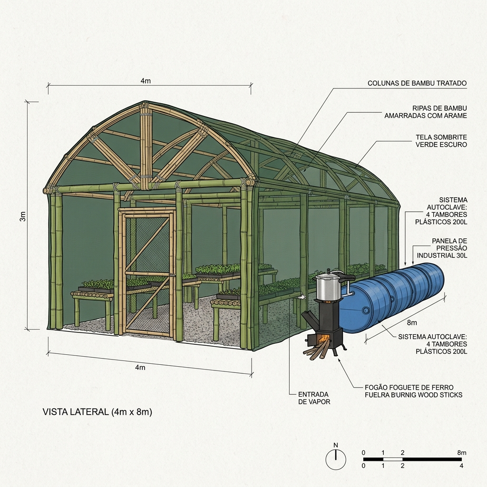

# 🌱 Viveiro-Educador Terra Viva

**Projeto**: Construção de Viveiro-Educador de Mudas 4m x 8m  
**Edital**: Plataforma Juventude Solidária — Ciclo 2026 (nº 01/2026 + Retificador 02/2026)  
**Valor**: R$ 12.000 (custeio) + R$ 12.000 (bolsa coordenador) = **R$ 24.000**  
**Proponente**: Murilo Miguel (Coletivo Terra Viva)  
**Status**: 📄 Proposta submetida

---

## 📋 Resumo do Projeto

Construção de um viveiro de mudas com estrutura de **bambu tratado ecologicamente** (Forno MPTDF a vapor), dimensões 4m x 8m, pé-direito 2,5m, com **sistema de irrigação por microaspersão** e capacidade para **3.000 mudas simultâneas**.

### Tecnologias Empregadas

| Tecnologia | Função |
|-----------|--------|
| **Forno Ecológico MPTDF** | Tratamento do bambu estrutural a vapor saturado com leite de cinzas e pirolenhoso |
| **Rocket Stove** | Fornalha de alta eficiência para aquecimento da autoclave |
| **Panela de Pressão 30L** | Gerador de vapor sob pressão |
| **Bombonas 200L (4x)** | Câmara de vaporização horizontal |
| **Microaspersão** | Irrigação automatizada com temporizador |

### Metas

| # | Meta | Indicador |
|---|------|-----------|
| 1 | Viveiro funcional construído | Estrutura 4m x 8m operacional |
| 2 | 10 jovens formados | Certificação em viveirismo agroecológico |
| 3 | 3.000 mudas produzidas | Mínimo 30% doadas para reflorestamento |
| 4 | Cooperativa jovem não-formal | Modelo autogestionário operacional |
| 5 | Mini-documentário | Vídeo curto do processo |

---

## 📊 Acompanhamento

### Cronograma

| Fase | Período | Atividades | Status |
|------|---------|------------|--------|
| **Mobilização** | Mês 1 | Reuniões, compra de materiais, coleta de sementes | ⏳ |
| **Construção** | Semanas 3-4 | Montagem autoclave, tratamento bambu, estrutura viveiro, irrigação | ⏳ |
| **Produção** | Meses 2-4 | Capacitação, produção de mudas, cadastro RENASEM | ⏳ |
| **Cooperativa** | Meses 4-6 | Cooperativa jovem, vendas, escoamento | ⏳ |

### Orçamento (R$ 12.000)

| Categoria | Valor |
|-----------|-------|
| Estrutura, cobertura e forno | R$ 3.800 |
| Sistema de irrigação | R$ 3.800 |
| Insumos para produção | R$ 2.000 |
| Ferramentas | R$ 1.600 |
| Material de apoio | R$ 800 |

---

## 📄 Documentos Relacionados

- [Proposta Final](https://github.com/takwaratec/plataforma-juventude-solidaria-2026/blob/main/02_PROPOSTAS/PROPOSTA_FINAL_VIVEIRO_EDUCADOR_TERRA_VIVA.md)
- [Edital nº 01/2026](https://github.com/takwaratec/plataforma-juventude-solidaria-2026/blob/main/Editais/)
- [Memorial Reunião Inaugural](https://github.com/takwaratec/plataforma-juventude-solidaria-2026/blob/main/12_REUNIOES/MEMORIAL_REUNIAO_2026-05-05.md)
- [Transcrições de Planejamento](https://github.com/takwaratec/plataforma-juventude-solidaria-2026/tree/main/12_REUNIOES)

---

## 📸 Registros

*Esquema ilustrativo do Viveiro 4m x 8m estruturado em bambu com cobertura de sombrite e da unidade autoclave móvel MPTDF (4 bombonas plásticas em série interligadas à panela de pressão de 30L no Rocket Stove).*

---

*Última atualização: Junho/2026*
